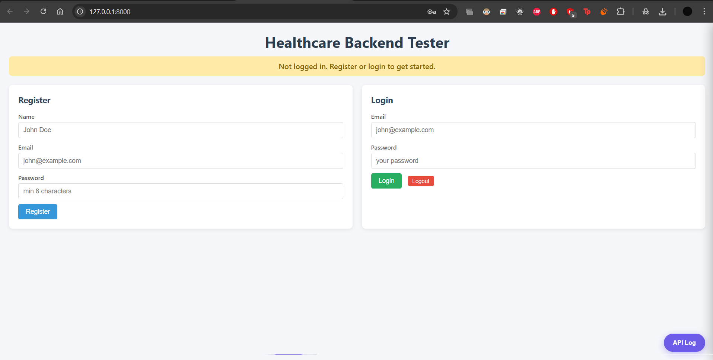
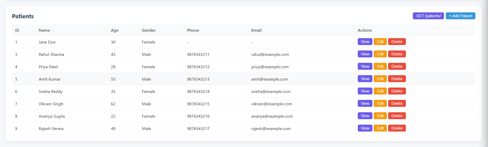
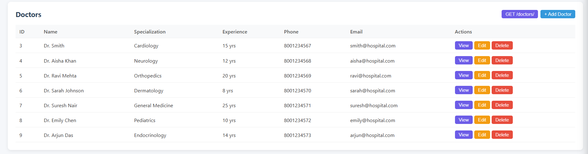
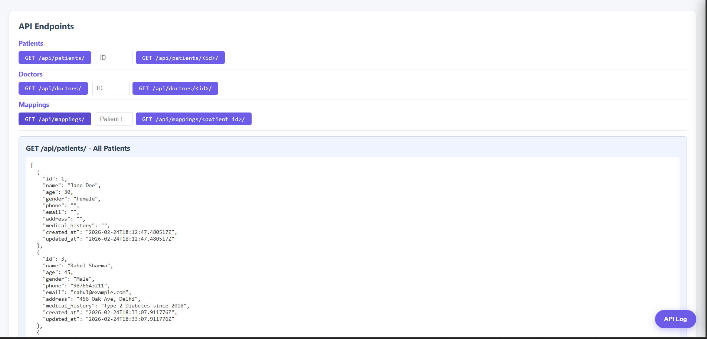
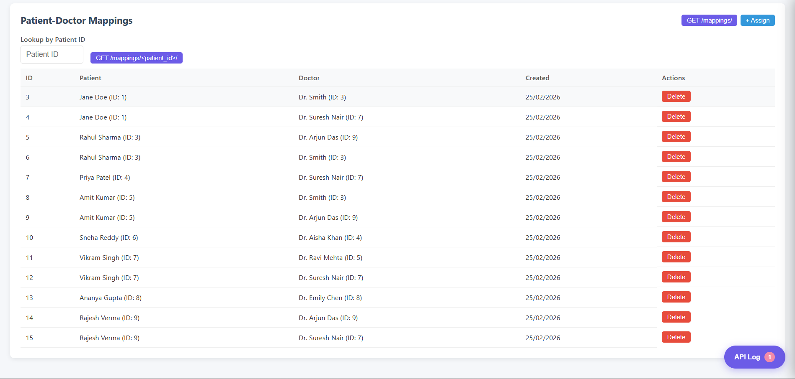
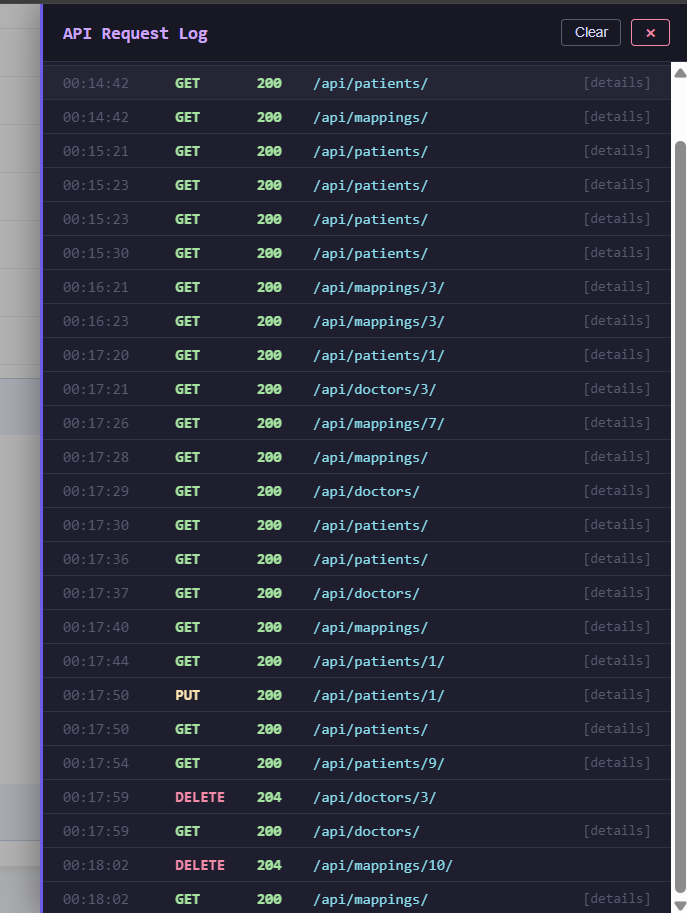

# Healthcare Backend

A full-stack healthcare management system built with Django REST Framework. Manage patients, doctors, and their assignments through a REST API with JWT authentication and a built-in frontend tester.

## Demo

https://github.com/user-attachments/assets/3138fd98-d79e-4672-9f14-d82ffeb1d600

### Screenshots

<details>
<summary>Click to view screenshots</summary>

#### Login & Registration
<!-- Replace with your actual screenshot -->


#### Patient Management


#### Doctor Management


#### API Endpoints Toolbar


#### Patient-Doctor Mappings


#### API Request Log Panel


</details>

---

## Tech Stack

| Layer          | Technology                          |
|----------------|-------------------------------------|
| Backend        | Django 5, Django REST Framework     |
| Auth           | JWT (djangorestframework-simplejwt) |
| Database       | PostgreSQL                          |
| Frontend       | Vanilla HTML/CSS/JS (Django-served) |
| Containerization | Docker & Docker Compose           |
| Server         | Gunicorn (production)               |

---

## API Endpoints

### Authentication (no token needed)

| Method | Endpoint              | Description                     |
|--------|-----------------------|---------------------------------|
| POST   | /api/auth/register/   | Register (name, email, password)|
| POST   | /api/auth/login/      | Login, returns JWT tokens       |

### Patients (token required)

| Method | Endpoint              | Description           |
|--------|-----------------------|-----------------------|
| POST   | /api/patients/        | Create a patient      |
| GET    | /api/patients/        | List your patients    |
| GET    | /api/patients/\<id\>/ | Get patient by ID     |
| PUT    | /api/patients/\<id\>/ | Update a patient      |
| DELETE | /api/patients/\<id\>/ | Delete a patient      |

### Doctors (token required)

| Method | Endpoint             | Description          |
|--------|----------------------|----------------------|
| POST   | /api/doctors/        | Create a doctor      |
| GET    | /api/doctors/        | List all doctors     |
| GET    | /api/doctors/\<id\>/ | Get doctor by ID     |
| PUT    | /api/doctors/\<id\>/ | Update a doctor      |
| DELETE | /api/doctors/\<id\>/ | Delete a doctor      |

### Patient-Doctor Mappings (token required)

| Method | Endpoint                      | Description                   |
|--------|-------------------------------|-------------------------------|
| POST   | /api/mappings/                | Assign a doctor to a patient  |
| GET    | /api/mappings/                | List all mappings             |
| GET    | /api/mappings/\<patient_id\>/ | Get doctors for a patient     |
| DELETE | /api/mappings/\<id\>/         | Remove a mapping              |

---

## Getting Started

### Option 1: Docker (Recommended)

Just run one command — no need to install Python, PostgreSQL, or anything else.

```bash
docker-compose up --build
```

Open `http://localhost:8000` in your browser. Done.

To stop:
```bash
docker-compose down
```

### Option 2: Manual Setup

#### Prerequisites
- Python 3.10+
- PostgreSQL

#### Steps

```bash
# 1. Clone the repo
git clone https://github.com/YOUR_USERNAME/healthcare-backend.git
cd healthcare-backend

# 2. Create virtual environment
python -m venv venv
source venv/bin/activate        # Linux/Mac
venv\Scripts\activate           # Windows

# 3. Install dependencies
pip install -r requirements.txt

# 4. Create PostgreSQL database
# In psql or pgAdmin:
# CREATE DATABASE healthcare_db;

# 5. Configure environment
# Create a .env file in the project root:
```

```env
SECRET_KEY=your-secret-key-here
DEBUG=True
ALLOWED_HOSTS=*
DB_NAME=healthcare_db
DB_USER=postgres
DB_PASSWORD=your_password
DB_HOST=localhost
DB_PORT=5432
```

```bash
# 6. Run migrations
python manage.py makemigrations api
python manage.py migrate

# 7. Start the server
python manage.py runserver
```

Open `http://127.0.0.1:8000` in your browser.

---

## Usage

### Using the Frontend Tester

1. Open `http://localhost:8000` in your browser
2. **Register** a new account with name, email, and password
3. **Login** with your credentials — the JWT token is auto-stored
4. Use the **API Endpoints** toolbar to test GET requests with one click
5. Create, edit, and delete **patients**, **doctors**, and **mappings** through the UI
6. Open the **API Log** panel (floating button, bottom-right) to see all request/response details

### Using the API Directly (curl)

```bash
# Register
curl -X POST http://localhost:8000/api/auth/register/ \
  -H "Content-Type: application/json" \
  -d '{"name": "John", "email": "john@example.com", "password": "mypassword123"}'

# Login
curl -X POST http://localhost:8000/api/auth/login/ \
  -H "Content-Type: application/json" \
  -d '{"email": "john@example.com", "password": "mypassword123"}'
# Save the "access" token from the response

# Create a patient (use your token)
curl -X POST http://localhost:8000/api/patients/ \
  -H "Content-Type: application/json" \
  -H "Authorization: Bearer YOUR_ACCESS_TOKEN" \
  -d '{"name": "Jane Doe", "age": 30, "gender": "Female"}'

# List patients
curl http://localhost:8000/api/patients/ \
  -H "Authorization: Bearer YOUR_ACCESS_TOKEN"
```

---

## Project Structure

```
healthcare-backend/
├── manage.py
├── requirements.txt
├── Dockerfile
├── docker-compose.yml
├── .dockerignore
├── .gitignore
├── .env                    # not committed (git-ignored)
├── healthcare/             # Django project config
│   ├── settings.py
│   ├── urls.py
│   ├── wsgi.py
│   └── asgi.py
├── api/                    # Main application
│   ├── models.py           # Patient, Doctor, PatientDoctorMapping
│   ├── serializers.py      # Validation & data serialization
│   ├── views.py            # API logic + frontend view
│   ├── urls.py             # Route definitions
│   ├── admin.py            # Django admin registration
│   ├── templates/api/
│   │   └── index.html      # Frontend tester page
│   └── static/api/
│       ├── app.js          # Frontend JavaScript
│       └── style.css       # Frontend styles
└── screenshots/            # Screenshots for README
```

---

## Environment Variables

| Variable       | Description           | Default                |
|----------------|-----------------------|------------------------|
| SECRET_KEY     | Django secret key     | change-me-in-production|
| DEBUG          | Debug mode            | True                   |
| ALLOWED_HOSTS  | Allowed hostnames     | *                      |
| DB_NAME        | PostgreSQL DB name    | healthcare_db          |
| DB_USER        | PostgreSQL username   | postgres               |
| DB_PASSWORD    | PostgreSQL password   | postgres               |
| DB_HOST        | PostgreSQL host       | localhost              |
| DB_PORT        | PostgreSQL port       | 5432                   |
